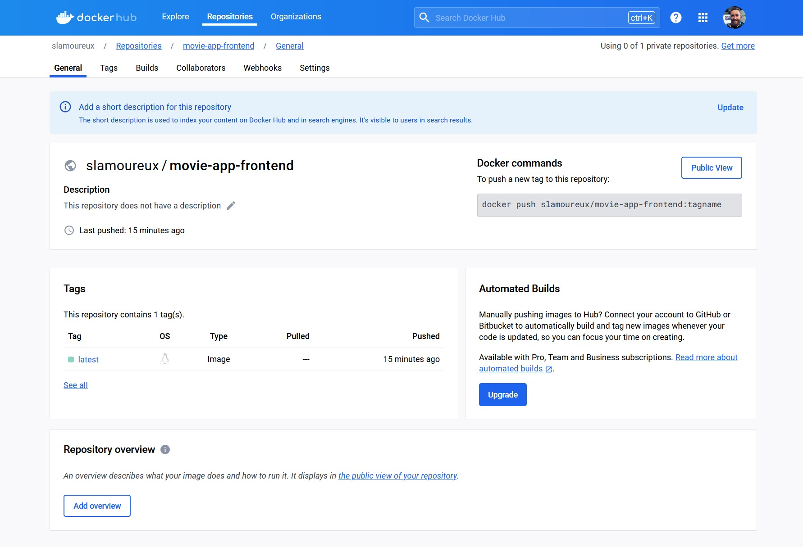
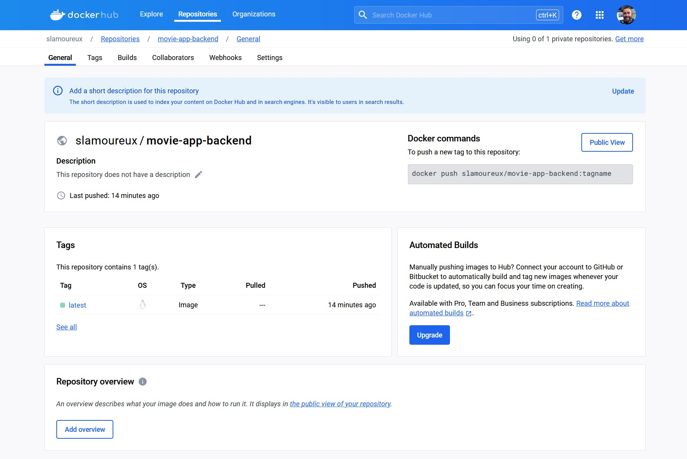

# Movie App

## Run the App

From the root directory:

```sh
docker compose up -d
```

## Push Images to DockerHub

Login to DockerHub:

```sh
docker login
```

Build the images:

```sh
docker-compose build
```

This command builds the images as per the docker-compose.yml file.

Push the images:

```sh
docker-compose push
```

This command pushes the images specified in your docker-compose.yml file to the Docker Hub repositories you've tagged them with.

### Frontend



### Backend



## Docker Network

```sh
docker network inspect movie-app-network
```

```sh
[
    {
        "Name": "movie-app-network",
        "Id": "4e7e15724f7693c1a8ab2b4a73933ff7dfe71e4f7cab925afa58fcb5c8eda5e0",
        "Created": "2024-01-18T02:56:51.037776682Z",
        "Scope": "local",
        "Driver": "bridge",
        "EnableIPv6": false,
        "IPAM": {
            "Driver": "default",
            "Options": null,
            "Config": [
                {
                    "Subnet": "192.168.112.0/20",
                    "Gateway": "192.168.112.1"
                }
            ]
        },
        "Internal": false,
        "Attachable": false,
        "Ingress": false,
        "ConfigFrom": {
            "Network": ""
        },
        "ConfigOnly": false,
        "Containers": {
            "1c9e328767ba0d77d99118e565b61a083d51733fba5603c2baded799591c7ad1": {
                "Name": "movie-app-database",
                "EndpointID": "35b2c70d29fcc61f10e1dc9cc3ea036cce21a795bd5e86223526a346a7397178",
                "MacAddress": "02:42:c0:a8:70:02",
                "IPv4Address": "192.168.112.2/20",
                "IPv6Address": ""
            },
            "27732312e9202238679eb749bd434c5f5ecedac14f25f64fc027af50481c6405": {
                "Name": "movie-app-backend",
                "EndpointID": "f1e0e6383a0f29f5980d1a63b4c68a127ed9bd50798c9404f004717906d895c9",
                "MacAddress": "02:42:c0:a8:70:03",
                "IPv4Address": "192.168.112.3/20",
                "IPv6Address": ""
            },
            "e90546772dafd5670d0c579aeb686893ea1f68c0fc356695d1d6ec6008ef7ceb": {
                "Name": "movie-app-frontend",
                "EndpointID": "5d6808d847a84576c95cd069e8b8b4444f0dea8d362f9f7a943f1280fc07e2cc",
                "MacAddress": "02:42:c0:a8:70:04",
                "IPv4Address": "192.168.112.4/20",
                "IPv6Address": ""
            }
        },
        "Options": {},
        "Labels": {
            "com.docker.compose.network": "movie-app-network",
            "com.docker.compose.project": "docker-node-movie-app",
            "com.docker.compose.version": "2.23.3"
        }
    }
]
```

## Docker Volume

```sh
docker volume list
```

```sh
DRIVER    VOLUME NAME
local     docker-node-movie-app_movie-app-postgres-config
local     docker-node-movie-app_movie-app-postgres-data
```
